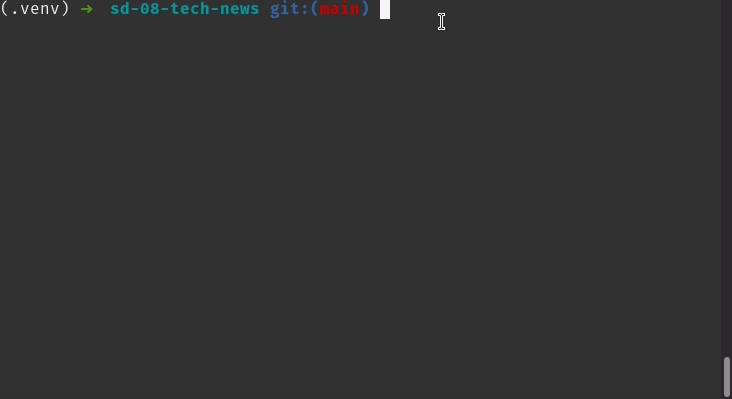

### Termos e acordos

Ao iniciar este projeto, você concorda com as diretrizes do Código de Ética e Conduta e do
Manual da Pessoa Estudante da Trybe.

# Boas vindas ao repositório do projeto de Tech News!

Você já usa o _GitHub_ diariamente para desenvolver os exercícios, certo? Agora, para desenvolver os projetos, você deverá seguir as instruções a seguir. Fique atento a cada passo, e se tiver qualquer dúvida, nos envie por _Slack_! #vqv 🚀

Aqui você vai encontrar os detalhes de como estruturar o desenvolvimento do seu projeto a partir desse repositório, utilizando uma branch específica e um _Pull Request_ para colocar seus códigos.

---

# Sumário

- [Habilidades](#habilidades)
- [Entregáveis](#Entregáveis)
  - [O que deverá ser desenvolvido](#o-que-deverá-ser-desenvolvido)
  - [Antes de começar a desenvolver](#antes-de-começar-a-desenvolver)
  - [Data de entrega](#data-de-entrega)
- [Intruções para entregar](#Instruções-para-entregar-seu-projeto)
  - [Durante o desenvolvimento](#durante-o-desenvolvimento)
  - [Depois de terminar o desenvolvimento](#depois-de-terminar-o-desenvolvimento)
  - [Revisando um pull request](#revisando-um-pull-request)
  - [Linter](#linter)
- [Como desenvolver](#como-desenvolver)
  - [Testes](#testes)
  - [Raspagem de notícias](#raspagem-de-notícias)
  - [MongoDB](#mongodb)

Lista de requisitos:
- [Requisitos obrigatórios](#requisitos-obrigatórios)
  - [1 - Crie a função fetch](#1---crie-a-função-fetch)
  - [2 - Crie a função scrape_novidades](#2---crie-a-função-scrape_novidades)
  - [3 - Crie a função scrape_next_page_link](#3---crie-a-função-scrape_next_page_link)
  - [4 - Crie a função scrape_noticia](#4---crie-a-função-scrape_noticia)
  - [5 - Crie a função get_tech_news para obter as notícias!](#5---crie-a-função-get_tech_news-para-obter-as-notícias)
  - [6 - Crie a função search_by_title](#6---crie-a-função-search_by_title)
  - [7 - Crie a função search_by_date](#7---crie-a-função-search_by_date)
  - [8 - Crie a função search_by_source,](#8---crie-a-função-search_by_source)
  - [9 - Crie a função search_by_category](#9---crie-a-função-search_by_category)
  - [10 - Crie a função top_5_news](#10---crie-a-função-top_5_news)
  - [11 - Crie a função top_5_categories](#11---crie-a-função-top_5_categories)
- [Requisitos bônus](#requisitos-bônus)
  - [12 - Crie a função analyzer_menu](#12---crie-a-função-analyzer_menu)
  - [13 - Implemente as funcionalidades do menu](#13---implemente-as-funcionalidades-do-menu)

- [Avisos finais](#avisos-finais)

---

# Habilidades

- Utilizar o terminal interativo do Python;
- Escrever seus próprios módulos e importá-los em outros códigos;
- Aplicar técnicas de raspagem de dados;
- Extrair dados de conteúdo HTML;
- Armazenar os dados obtidos em um banco de dados.

---

# Entregáveis

Para entregar o seu projeto você deverá criar um _Pull Request_ neste repositório. Este _Pull Request_ deverá conter o diretório `tech_news` e o diretório `tests` com seus arquivos, que conterão seu código `Python` e seus testes, respectivamente.

**🚨 É importante que seus arquivos tenham exatamente estes nomes!**

Você pode adicionar outros arquivos se julgar necessário. Qualquer dúvida, nos procure.

Lembre-se que você pode consultar nosso conteúdo sobre [_Git & GitHub_](https://app.betrybe.com/course/fundamentals/git-github-e-internet/git-github-o-que-e-e-para-que-serve/82dcab41-249a-4738-8920-f0eb2cb91d1c) sempre que precisar!

---

## O que deverá ser desenvolvido

Você fará um projeto que tem como principal objetivo fazer consultas em notícias sobre tecnologia. Para isso será necessário criar um banco de dados, obter dados para popular este banco, e preparar consultas a serem feitas nestas notícias.

As notícias podem ser obtidas através da raspagem das [últimas notícias do _TecMundo_](https://www.tecmundo.com.br/novidades).

---
## Antes de começar a desenvolver:

1. Clone o repositório

- `git clone https://github.com/tryber/sd-011-tech-news.git`.
- Entre na pasta do repositório que você acabou de clonar:
  - `sd-011-tech-news`

2. Crie o ambiente virtual para o projeto

- `python3 -m venv .venv && source .venv/bin/activate`

3. Instale as dependências

- `python3 -m pip install -r dev-requirements.txt`

4. Crie uma branch a partir da branch `main`

- Verifique que você está na branch `main`
  - Exemplo: `git branch`
- Se não estiver, mude para a branch `main`
  - Exemplo: `git checkout main`
- Agora crie uma branch à qual você vai submeter os `commits` do seu projeto
  - Você deve criar uma branch no seguinte formato: `nome-github-nome-do-projeto`
  - Exemplo: `git checkout -b exemplo-tech-news`

5. Adicione as mudanças ao _stage_ do Git e faça um `commit`

- Verifique que as mudanças ainda não estão no _stage_
  - Exemplo: `git status` (deve aparecer listada a pasta _exemplo_ em vermelho)
- Adicione o novo arquivo ao _stage_ do Git
  - Exemplo:
    - `git add .` (adicionando todas as mudanças - _que estavam em vermelho_ - ao stage do Git)
    - `git status` (deve aparecer listado o arquivo _exemplo/README.md_ em verde)
- Faça o `commit` inicial
  - Exemplo:
    - `git commit -m 'iniciando o projeto tech-news'` (fazendo o primeiro commit)
    - `git status` (deve aparecer uma mensagem tipo _nothing to commit_ )

6. Adicione a sua branch com o novo `commit` ao repositório remoto

- Usando o exemplo anterior: `git push -u origin exemplo-project-name`

7. Crie um novo `Pull Request` _(PR)_

- Vá até a página de _Pull Requests_ do [repositório no _GitHub_](https://github.com/tryber/sd-011-tech-news/pulls)
- Clique no botão verde _"New pull request"_
- Clique na caixa de seleção _"Compare"_ e escolha a sua branch **com atenção**
- Clique no botão verde _"Create pull request"_
- Adicione uma descrição para o _Pull Request_ e clique no botão verde _"Create pull request"_
- **Não se preocupe em preencher mais nada por enquanto!**
- Volte até a [página de _Pull Requests_ do repositório](https://github.com/tryber/sd-011-tech-news/pulls) e confira que o seu _Pull Request_ está criado

---

## Data de Entrega

- Serão `2` dias de projeto.
- Data de entrega para avaliação final do projeto: `21/02/2022 14:00`.

---
# Instruções para entregar seu projeto:

## Durante o desenvolvimento

Este repositório contém um _template_ com uma estrutura de diretórios e arquivos. Na estrutura deste _template_, você deve implementar as funções necessárias. Novos arquivos e funções podem ser criados conforme a necessidade da sua implementação, porém não remova arquivos já existentes.

- Faça `commits` das alterações que você fizer no código regularmente

- Lembre-se de sempre após um (ou alguns) `commits` atualizar o repositório remoto

- Os comandos que você utilizará com mais frequência são:
  1. `git status` _(para verificar o que está em vermelho - fora do stage - e o que está em verde - no stage)_
  2. `git add` _(para adicionar arquivos ao stage do Git)_
  3. `git commit` _(para criar um commit com os arquivos que estão no stage do Git)_
  4. `git push` _(para enviar o commit para o repositório remoto após o passo anterior)_
  5. `git push -u nome-da-branch` _(para enviar o commit para o repositório remoto na primeira vez que fizer o `push` de uma nova branch)_

- ⚠ Seu projeto não será avaliado com issues no linter, atente-se para manter seu código dentro dos padrões esperados.
---

## Depois de terminar o desenvolvimento

Para **"entregar"** seu projeto, siga os passos a seguir:

- Vá até a página **DO SEU** _Pull Request_, adicione a label de _"code-review"_ e marque seus colegas
  - No menu à direita, clique no _link_ **"Labels"** e escolha a _label_ **code-review**
  - No menu à direita, clique no _link_ **"Assignees"** e escolha **o seu usuário**
  - No menu à direita, clique no _link_ **"Reviewers"** e digite `students`, selecione o time `tryber/students-sd-011`

Se ainda houver alguma dúvida sobre como entregar seu projeto, [aqui tem um video explicativo](https://vimeo.com/362189205).

⚠ Lembre-se que garantir que todas as _issues_ comentadas pelo **Lint** estão resolvidas!

---

## Revisando um pull request

À medida que você e as outras pessoas que estudam na Trybe forem entregando os projetos, vocês receberão um alerta via Slack para também fazer a revisão dos Pull Requests dos seus colegas. Fiquem atentos às mensagens do "Pull Reminders" no Slack!

Use o material que você já viu sobre [Code Review](https://app.betrybe.com/course/real-life-engineer/code-review) para te ajudar a revisar os projetos que chegaram para você.

---

## Linter

Para garantir a qualidade do código, vamos utilizar neste projeto o linter `Flake8`.
Assim o código estará alinhado com as boas práticas de desenvolvimento, sendo mais legível
e de fácil manutenção! Para rodá-lo localmente no projeto, execute o comandos abaixo:

```bash
python3 -m flake8
```

⚠️ Pull Requests com problemas de linter não serão avaliados.

---

# Como desenvolver

## Testes

Para executar os testes certifique-se de que os seguintes passos foram realizados;

1. **criar o ambiente virtual**

```bash
$ python3 -m venv .venv
```

2. **ativar o ambiente virtual**

```bash
$ source .venv/bin/activate
```

3. **instalar as dependências no ambiente virtual**

```bash
$ python3 -m pip install -r dev-requirements.txt
```

📚 Se quiser saber mais sobre a instalação de dependências com `pip`, veja esse [artigo](https://medium.com/python-pandemonium/better-python-dependency-and-package-management-b5d8ea29dff1).

Com o seu ambiente virtual ativo, as dependências serão instaladas neste ambiente.
Quando precisar desativar o ambiente virtual, execute o comando "deactivate". Lembre-se de ativar novamente quando voltar a trabalhar no projeto.

O arquivo `dev-requirements.txt` contém todas as dependências que serão utilizadas no projeto, ele está agindo como se fosse um `package.json` de um projeto `Node.js`.

Com esta preparação feita, podemos executar os testes:

**Executar os testes**

```bash
$ python3 -m pytest
```

Este comando irá executar todos os testes do projeto. Caso o teste falhe e você queira ter um print melhor do erro basta executar o seguinte comando:

```bash
python3 -m pytest -s -vv
```

Caso precise executar apenas um arquivo de testes basta executar o comando:

```bash
python3 -m pytest tests/nomedoarquivo.py
```

Para resolver um problema de cada vez, utilize o argumento `-x` para o Pytest encerrar a execução no primeiro erro que encontrar:

```bash
python3 -m pytest tests/nomedoarquivo.py -x
```

✍️ **Teste manual**: abra um terminal Python importando as funções de interesse através do comando `python3 -i tech_news/arquivo_de_interesse.py` e as invoque utilizando diferentes parâmetros. Exemplo:




**Verificar o estilo**
Para verificar se você está seguindo o guia de estilo do Python corretamente, execute o comando:


```bash
$ python3 -m flake8
```

---

## Raspagem de notícias

As notícias a serem raspadas estarão disponíveis na aba de últimas notícias do _TecMundo_: https://www.tecmundo.com.br/novidades.
Essas notícias devem ser salvas no banco de dados utilizando as funções python que já vêm prontas no módulo `database.py`

## MongoDB

Para a realização deste projeto, utilizaremos um banco de dados chamado `tech_news`, e as notícias serão armazenadas em uma coleção chamada `news`. Já existem algumas funções prontas no arquivo `tech_news/database.py` que te auxiliarão no desenvolvimento. Não altere as funções deste arquivo; mudanças nele não serão executadas no avaliador automático.

Para instalar e rodar o servidor MongoDB, siga as instruções no tutorial oficial:
Ubuntu: https://docs.mongodb.com/manual/tutorial/install-mongodb-on-ubuntu/
MacOS:  https://docs.mongodb.com/guides/server/install/

Lembre-se de que o mongoDB utilizará por padrão a porta 27017. Se já houver outro serviço utilizando esta porta, considere desativá-lo.

---

# Requisitos obrigatórios:

### 1 - Crie a função `fetch`
local: `tech_news/scraper.py`

Antes de fazer scrape, precisamos de uma página! Esta função será responsável por fazer a requisição HTTP ao site Tecmundo e obter o conteúdo HTML.
Alguns cuidados deverão ser tomados: como a nossa função poderá ser utilizada váras vezes em sucessão, na nossa implementação devemos nos assegurar que um [Rate Limit](https://app.betrybe.com/course/computer-science/redes-e-raspagem-de-dados/raspagem-de-dados/ab38ab4e-bdbd-4984-8987-1abf32d85f26/conteudos/4edde8f1-9d55-4c98-a593-e3043848a127/alguns-problemas/) será respeitado.

- A função deve receber uma URL
- A função deve fazer uma requisição HTTP `get` para esta URL utilizando a função `requests.get`
- A função deve retornar o conteúdo HTML da resposta.
- A função deve respeitar um Rate Limit de 1 requisição por segundo; Ou seja, caso chamada múltiplas vezes, ela deve aguardar 1 segundo entre cada requisição que fizer.
**Dica:** Uma forma simples de garantir que cada requisição seja feita com um intervalo mínimo de um segundo é utilizar `time.sleep(1)` antes de cada requisição. (Existem outras formas mais eficientes.)
- Caso a requisição seja bem sucedida com `Status Code 200: OK`, deve ser retornado seu conteúdo de texto;
- Caso a resposta tenha o código de status diferente de `200`, deve-se retornar `None`;
- Caso a requisição não receba resposta em até 3 segundos, ela deve ser abandonada (este caso é conhecido como "Timeout") e a função deve retornar None.

✍️ Teste manual: abra um terminal Python importando estas funções através do comando `python3 -i tech_news/scraper.py` e as invoque utilizando diferentes parâmetros. Exemplo: 
```python
>>> html = fetch(url_da_noticia)
>>> scrape_noticia(html)
```

**🤖 O que será verificado pelo avaliador:**
- A função utiliza o método get() da biblioteca requests
- A função executada com uma URL correta retorna o conteúdo html
- A função, sofrendo timeout, retorna None
- A função retorna None quando recebe uma resposta com código diferente de 200
- A função respeita o rate limit


### 2 - Crie a função `scrape_novidades`
local: `tech_news/scraper.py`

Para conseguirmos fazer o scrape da página de uma notícia, primeiro precisamos de links para várias páginas de notícias. Estes links estão contidos na página Novidades (https://www.tecmundo.com.br/novidades). 

Esta função fará o scrape da página Novidades para obter as URLs das páginas de notícias. Vamos utilizar as ferramentas que aprendemos no curso, como a biblioteca Parsel, para obter os dados que queremos de cada página.

- A função deve receber uma string com o conteúdo HTML da página Novidades (https://www.tecmundo.com.br/novidades)
- A função deve fazer o scrape do conteúdo recebido para obter uma lista contendo as URLs das notícias listadas.
- A função deve retornar esta lista.
- Caso não encontre nenhuma URL de notícia, a função deve retornar uma lista vazia.

✍️ Teste manual: abra um terminal Python importando estas funções através do comando `python3 -i tech_news/scraper.py` e as invoque utilizando diferentes parâmetros. Exemplo: 
```python
>>> html = fetch(url_da_noticia)
>>> scrape_novidades(html)
```

**🤖 O que será verificado pelo avaliador:**
- A função retorna os dados esperados quando chamada com os parâmetros corretos
- A função retorna uma lista vazia quando chamada com parâmetros incorretos

### 3 - Crie a função `scrape_next_page_link`
local: `tech_news/scraper.py`

Para buscar mais notícias, precisaremos fazer a paginação, e para isto, vamos precisar do link da próxima página. Esta função será responsável por fazer o scrape deste link.

- A função deve receber como parâmetro uma `string` contendo o conteúdo HTML da página de novidades (https://www.tecmundo.com.br/novidades)
- A função deve fazer o scrape deste HTML para obter a URL da próxima página.
- A função deve retornar a URL obtida.
- Caso não encontre o link da próxima página, a função deve retornar `None`

**🤖 O que será verificado pelo avaliador:**
- A função retorna os dados esperados quando chamada com os parâmetros corretos
- A função retorna None quando chamada com os parâmetros incorretos

### 4 - Crie a função `scrape_noticia`
local: `tech_news/scraper.py`

Agora que sabemos pegar páginas HTML, e descobrir o link de notícias, é hora de fazer o scrape dos dados que procuramos! 

- A função deve receber como parâmetro o conteúdo HTML da página de uma única notícia da Tecmundo
- A função deve, no conteúdo recebido, buscar as informações das notícias para preencher um dicionário com os seguintes atributos:
  - `url` - link para acesso da notícia. Ex: "https://www.tecmundo.com.br/mobilidade-urbana-smart-cities/155000-musk-tesla-carros-totalmente-autonomos.htm"
  - `title` - título da notícia. Ex: "Musk: Tesla está muito perto de carros totalmente autônomos"
  - `timestamp` - data e hora da notícia. Ex: "2020-07-09T11:00:00"
  - `writer` - nome da pessoa autora da notícia. Ex: "Nilton Kleina". Se a informação não for encontrada, salve este atributo como `None`
  - `shares_count` - número de compartilhamento da notícia. Ex: `61`. Se a informação não for encontrada, salve este atributo como `0` (zero)
  - `comments_count` - número de comentários que a notícia recebeu. Ex: `26`
  - `summary` - o primeiro parágrafo da notícia. Ex:"O CEO da Tesla, Elon Musk, garantiu que a montadora está muito perto de atingir o chamado nível 5 de autonomia de sistemas de piloto automático de carros. A informação foi confirmada em uma mensagem enviada pelo executivo aos participantes da Conferência Anual de Inteligência Artificial (WAIC, na sigla em inglês). O evento aconteceu em Xangai, na China, onde a montadora comemora resultados positivos de mercado."
  - `sources` - lista contendo fontes da notícia. Ex: ["Venture Beat", "Source 2"]
  - `categories` - lista de categorias que classificam a notícia. Ex: ["Mobilidade Urbana/Smart Cities", "Veículos autônomos", "Tesla", "Elon Musk"]

- Exemplo de um retorno da função com uma notícia específica:

```json
{
  "url": "https://www.tecmundo.com.br/mobilidade-urbana-smart-cities/155000-musk-tesla-carros-totalmente-autonomos.htm",
  "title": "Musk: Tesla está muito perto de carros totalmente autônomos",
  "timestamp": "2020-07-09T11:00:00",
  "writer": "Nilton Kleina",
  "shares_count": 61,
  "comments_count": 26,
  "summary": "O CEO da Tesla, Elon Musk, garantiu que a montadora está muito perto de atingir o chamado nível 5 de autonomia de sistemas de piloto automático de carros. A informação foi confirmada em uma mensagem enviada pelo executivo aos participantes da Conferência Anual de Inteligência Artificial (WAIC, na sigla em inglês). O evento aconteceu em Xangai, na China, onde a montadora comemora resultados positivos de mercado.",
  "sources": ["Venture Beat"],
  "categories": [
    "Mobilidade Urbana/Smart Cities",
    "Veículos autônomos",
    "Tesla",
    "Elon Musk"
  ]
}
```

📌 Muita atenção aos tipos dos campos, por exemplo, `sources` e `categories` são listas, assim como `shares_count` e `comments_count` são numéricos.

📌 **Dica para fazer o scraping:** Caso uma tag possua outras tags aninhadas, para obter todos os textos da tag ancestral e de suas tags descendentes, utilize `*::text` no seletor.

- Exemplo:
  ```html
  <p>
    Recentemente, a Alemanha fez a
    <a
      href="https://www.tecmundo.com.br/mobilidade-urbana-smart-cities/155000-musk-tesla-carros-totalmente-autonomos.htm"
      rel="noopener noreferrer"
      target="_blank"
      >Tesla</a
    >
    “pisar no freio” quanto ao uso de termos comerciais relacionados a carros
    autônomos, mas quem pensa que esse é um sinal de resistência à introdução de
    novas tecnologias se engana. Isso porque, de acordo o
    <em>Automotive News Europe</em>, o país está se preparando para se tornar o
    primeiro do mundo a criar uma ampla estrutura para regulamentar tais
    veículos de nível 4.
  </p>
  ```
  Repare que no exemplo dentro da tag _p_ encontram-se duas outras tags. Esse é um caso onde a tag _p_ é um ancestral e as tags _a_ e _em_ são as descendentes. Para obter todo o texto do exemplo, utiliza-se `*::text` no seletor.

📌 **É bom saber que** ao fazer scraping na vida real, você está sempre "refém" de quem construiu o site. Por exemplo, pode ser que nem toda notícia tenha **exatamente** o mesmo HTML/CSS e você precise de criatividade para contornar isso. 


**🤖 O que será verificado pelo avaliador:**
- Será verificado se a função retorna o conteúdo correto e no formato correto, dada uma página de notícia exemplo.


👍 Terminou o requisito 4? Parabéns! Este é o requisito mais longo do projeto, e também a funcionalidade central do nosso tech-news. Faça um break, tome uma água, e #vamoquevamo para os próximos requisitos!

### 5 - Crie a função `get_tech_news` para obter as notícias!
local: `tech_news/scraper.py`

Agora, chegou a hora de aplicar todas as funções que você acabou de fazer. Com estas ferramentas prontas, podemos fazer nosso scraper mais robusto com a paginação.

- A função deve receber como parâmetro um número inteiro `n` e buscar as últimas `n` notícias do site.
- Utilize as funções `fetch`, `scrape_novidades`, `scrape_next_page_link` e `scrape_noticia` para buscar as notícias e processar seu conteúdo.
- As notícias buscadas devem ser inseridas no MongoDB; Para acessar o banco de dados, importe e utilize as funções que já temos prontas em `tech_news/database.py`
- Após inserir as notícias no banco, a função deve retornar estas mesmas notícias.

📌 De aqui em diante, usaremos o MongoDB. Para instalar e rodar o servidor MongoDB, siga as instruções no tutorial oficial:
Ubuntu: https://docs.mongodb.com/manual/tutorial/install-mongodb-on-ubuntu/
MacOS:  https://docs.mongodb.com/guides/server/install/
Com o servidor rodando, o nosso módulo conseguirá acessá-lo sem problemas. Importe o módulo `tech_news/database.py` e chame as funções contidas nele.
Não altere as funções deste módulo; elas serão utilizadas nos testes.

**🤖 O que será verificado pelo avaliador:**
- A função `create_news` do `tech_news/database.py` foi chamada corretamente
- A função retorna a quantidade correta de notícias

### 6 - Crie a função `search_by_title`
local: `tech_news/analyzer/search_engine.py`

Agora que temos meios de popular nosso banco de dados com notícias, podemos começar a fazer as buscas! Esta função irá fazer buscas por título.

- A função deve receber uma string com um título de notícia
- A função deve buscar as notícias do banco de dados por título
- A função deve retornar uma lista de tuplas com as notícias encontradas nesta busca. 
Exemplo: 
```python
[
  ("Título1_aqui", "url1_aqui"),
  ("Título2_aqui", "url2_aqui"),
  ("Título3_aqui", "url3_aqui"),
]
```
- A busca deve ser _case insensitive_
- Caso nenhuma notícia seja encontrada, deve-se retornar uma lista vazia.

📌 Lembre-se; para acesso ao banco de dados importe `db` definido no módulo `tech_news/database.py`.

✍️ Teste manual: abra um terminal Python importando esta função através do comando `python3 -i tech_news/analyzer/search_engine.py` e invoque a função utilizando diferentes parâmetros. Exemplo: `search_by_title("Musk")`.

**O que será verificado:**

- Será validado que é possível buscar uma notícia pelo título com sucesso

- Será validado que ao buscar por um título que não existe, o retorno deve ser uma lista vazia

- Será validado que é possível buscar uma notícia com sucesso, tanto pelo título em maiúsculas como em minúsculas.

### 7 - Crie a função `search_by_date`
local: `tech_news/analyzer/search_engine.py`

Esta função irá buscar as notícias do banco de dados por data.

- A função deve receber como parâmetro uma data no formato "aaaa-mm-dd"
- A função deve buscar as notícias do banco de dados por data.
- A função deve ter retorno no mesmo formato do requisito anterior.
- Caso a data seja inválida, ou esteja em outro formato, uma exceção `ValueError` deve ser lançada com a mensagem `Data inválida`.
- Caso nenhuma notícia seja encontrada, deve-se retornar uma lista vazia.

✍️ Teste manual: abra um terminal Python importando esta função através do comando `python3 -i tech_news/analyzer/search_engine.py` e invoque a função utilizando diferentes parâmetros. Exemplo: `search_by_date("2020-11-11")`.

**O que será verificado:**

- Será validado que é possível buscar uma notícia pela data com sucesso

- Será validado que ao buscar por uma data que não existe, o retorno deve ser uma lista vazia

- Sera validado que ao buscar por uma data com formato inválido, deve lançar um erro `ValueError` com a mensagem `Data inválida`.

### 8 - Crie a função `search_by_source`,
local: `tech_news/analyzer/search_engine.py`

Esta função irá buscar as notícias por fonte.

- A função deve receber como parâmetro o nome da fonte completo.
- A função deve buscar as notícias do banco de dados por fonte.
- A função deve ter retorno no mesmo formato do requisito anterior.
- Caso nenhuma notícia seja encontrada, deve-se retornar uma lista vazia.
- A busca deve ser _case insensitive_

✍️ Teste manual: abra um terminal Python importando esta função através do comando `python3 -i tech_news/analyzer/search_engine.py` e invoque a função utilizando diferentes parâmetros. Exemplo: `search_by_source("Venture Beat")`.

**O que será verificado:**

- Será validado que é possível buscar uma notícia pela fonte com sucesso

- Será validado que ao buscar por uma fonte que não existe, o retorno deve ser uma lista vazia

- Será validado que é possível buscar uma notícia tanto pela fonte em maiúsculas como em minúsculas

### 9 - Crie a função `search_by_category`
local: `tech_news/analyzer/search_engine.py`

Esta função irá buscar as notícias por categoria.

- A função deve receber como parâmetro o nome da categoria completo.
- A função deve buscar as notícias do banco de dados por categoria.
- A função deve ter retorno no mesmo formato do requisito anterior.
- Caso nenhuma notícia seja encontrada, deve-se retornar uma lista vazia.
- A busca deve ser _case insensitive_

✍️ Teste manual: abra um terminal Python importando esta função através do comando `python3 -i tech_news/analyzer/search_engine.py` e invoque a função utilizando diferentes parâmetros. Exemplo: `search_by_category("Tesla")`.

**O que será verificado:**

- Será validado que é possível buscar uma notícia pela categoria com sucesso

- Será validado que ao buscar por uma categoria que não existe, o retorno deve ser uma lista vazia

- Será validado que é possível buscar uma notícia tanto pela categoria em maiúsculas como em minúsculas

### 10 - Crie a função `top_5_news`
local: `tech_news/analyzer/ratings.py`

Esta função irá listar as cinco notícias mais populares; nosso critério de popularidade será a soma dos compartilhamentos e comentários.

- A função deve buscar as notícias do banco de dados e calcular a sua "popularidade" somando seu número de compartilhamentos e comentários.
- A função deve ordenar as notícias por ordem de popularidade.
- Em caso de empate, o desempate deve ser por ordem alfabética de título.
- A função deve ter retorno no mesmo formato do requisito anterior, porém limitado a 5 notícias.
- Caso haja menos de cinco notícias, no banco de dados, deve-se retornar todas as notícias existentes;
- Caso não haja notícias disponíveis, deve-se retornar uma lista vazia.

✍️ Teste manual: abra um terminal Python importando esta função através do comando `python3 -i tech_news/analyzer/ratings.py` e invoque a função utilizando diferentes parâmetros. Exemplo: `top_5_news()`.

**O que será verificado:**

- Será validado que é possível buscar as cinco top notícias

- Será validado que é possível buscar as cinco top notícias e retornar vazio caso não tenha nenhuma notícia

- Caso houver menos de 5 notícias, serão retornadas quantas houverem


### 11 - Crie a função `top_5_categories`
local: `tech_news/analyzer/ratings.py`

Esta função irá listar as cinco categorias com maior ocorrência no banco de dados. 

- As categorias devem ser ordenadas por ordem alfabética.
- As top 5 categorias da análise devem ser retornadas em uma lista no formato `["category1", "category2"]`;
- Caso haja menos de cinco categorias, no banco de dados, deve-se retornar todas as categorias existentes;
- Caso não haja categorias disponíveis, deve-se retornar uma lista vazia.

✍️ Teste manual: abra um terminal Python importando esta função através do comando `python3 -i tech_news/analyzer/ratings.py` e invoque a função utilizando diferentes parâmetros. Exemplo: `top_5_categories()`.

**O que será verificado:**

- Será validado que é possível buscar as cinco top categorias

- Será validado que é possível buscar as cinco top categorias e retornar vazio caso não tenha nenhuma notícia

- Caso houver menos de 5 categorias, serão retornadas quantas houverem

---

## Requisitos bônus:

### 12 - Crie a função `analyzer_menu`
local: `tech_news/menu.py`

Esta função é o menu do nosso programa. Através dele poderemos operar as funcionalidades que criamos. Será um menu de opções, em que cada opção pede as informações necessárias para disparar uma ação.

- O texto exibido pelo menu deve ser exatamente:
```
Selecione uma das opções a seguir:
 0 - Popular o banco com notícias;
 1 - Buscar notícias por título;
 2 - Buscar notícias por data;
 3 - Buscar notícias por fonte;
 4 - Buscar notícias por categoria;
 5 - Listar top 5 notícias;
 6 - Listar top 5 categorias;
 7 - Sair.
```

- Caso a opção `0` seja selecionada, seve-se exibir a mensagem "Digite quantas notícias serão buscadas:"

- Caso a opção `1` seja selecionada, deve-se exibir a mensagem "Digite o título:";

- Caso a opção `2` seja selecionada, deve-se exibir a mensagem "Digite a data no formato aaaa-mm-dd:";

- Caso a opção `3` seja selecionada, deve-se exibir a mensagem "Digite a fonte:";

- Caso a opção `4` seja selecionada, deve-se exibir a mensagem "Digite a categoria:";

- Caso a opção não exista, exiba a mensagem de erro "Opção inválida" na `stderr`.

📌 A função `input` deve ser utilizada para receber a entrada de dados da pessoa usuária.

✍️ Teste manual: dentro de um ambiente virtual onde seu projeto foi configurado, digite o comando `tech-news-analyzer`, o menu deve ser exibido. Isto acontece pois durante a configuração inicial do projeto já configuramos para que a função seja corretamente chamada quando este comando seja invocado.

### 13 - Implemente as funcionalidades do menu
local: `tech_news/menu.py`

- Quando selecionada uma opção do menu, e inseridas as informações necessárias, a ação adequada deve ser realizada.

- Caso a opção `0` seja selecionada, a importação deve ser feita utilizando a função `get_tech_news`;

- Caso a opção `1` seja selecionada, a importação deve ser feita utilizando a função `search_by_title` e seu resultado deve ser impresso em tela;

- Caso a opção `2` seja selecionada, a exportação deve ser feita utilizando a função `search_by_date` e seu resultado deve ser impresso em tela;

- Caso a opção `3` seja selecionada, a importação deve ser feita utilizando a função `search_by_source` e seu resultado deve ser impresso em tela;

- Caso a opção `4` seja selecionada, a exportação deve ser feita utilizando a função `search_by_category` e seu resultado deve ser impresso em tela;

- Caso a opção `5` seja selecionada, a raspagem deve ser feita utilizando a função `top_5_news` e seu resultado deve ser impresso em tela;

- Caso a opção `6` seja selecionada, a raspagem deve ser feita utilizando a função `top_5_categories` e seu resultado deve ser impresso em tela;

- Caso a opção `7` seja selecionada, deve-se encerrar a execução do script e deve-se exibir a mensagem "Encerrando script";

- Caso alguma exceção seja lançada, a mesma deve ser capturada e sua mensagem deve ser exibida na saída padrão de erros (`stderr`).

✍️ Teste manual: dentro de um ambiente virtual onde seu projeto foi configurado, digite o comando `tech-news-analyzer`, assim você conseguirá interagir com o menu.

---

# Avisos Finais

Ao finalizar e submeter o projeto, não se esqueça de avaliar sua experiência preenchendo o formulário. Leva menos de 3 minutos!

Link: [FORMULÁRIO DE AVALIAÇÃO DE PROJETO](https://bit.ly/2OfLJPn)

O avaliador automático não necessariamente avalia seu projeto na ordem em que os requisitos aparecem no readme. Isso acontece para deixar o processo de avaliação mais rápido. Então, não se assuste se isso acontecer, ok?

---
